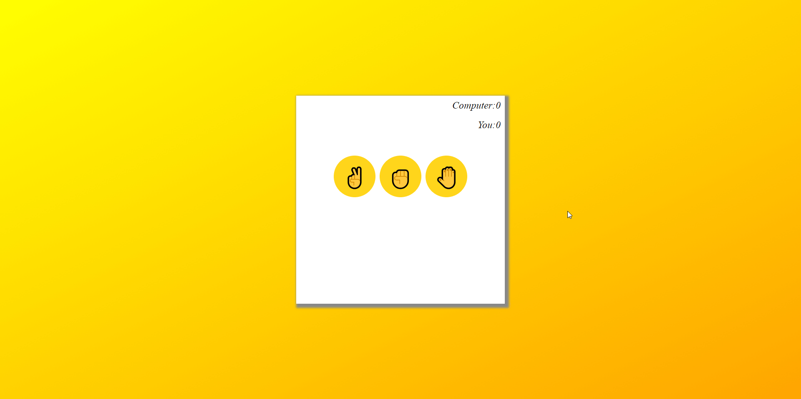

# Rock Paper Scissors Game

## Description

This is a simple Rock Paper Scissors game built using HTML, CSS, and JavaScript. The game allows a user to play against the computer, with the score being tracked throughout the session.

## How to Play

1. Open the game in your browser.
2. Choose your move by clicking one of the three buttons: ✌️ (Scissors), ✊ (Rock), or 🤚 (Paper).
3. The computer will randomly choose its move.
4. The result of the round (win, lose, or tie) will be displayed, and the scores will be updated accordingly.

## Files

- **index.html**: The main HTML file containing the structure of the game.
- **style.css**: The CSS file that styles the game interface.
- **script.js**: The JavaScript file containing the game logic.

## Game Interface

- **Score Display**: The scores of both the player and the computer are displayed at the top right corner.
- **Play Area**: The buttons for Scissors, Rock, and Paper are located in the middle of the screen.
- **Results Display**: The choices made by both the player and the computer, as well as the result of the round, are displayed below the play area.

## Styles

- The game is centered on the screen with a background gradient from yellow to orange.
- The container is styled with a white background and a shadow for a clean, modern look.
- Buttons are circular with a hover effect that enlarges them slightly.
- The result of each round is highlighted with a color-coded message: green for a win, red for a loss.

## Game Logic

- The computer randomly selects its move from "rock", "paper", or "scissors".
- The winner is determined based on standard Rock Paper Scissors rules:
  - Rock beats Scissors
  - Scissors beats Paper
  - Paper beats Rock
- The game updates the score and displays the result of each round.

## Credits

This game was created as a fun and interactive project using basic web technologies.
